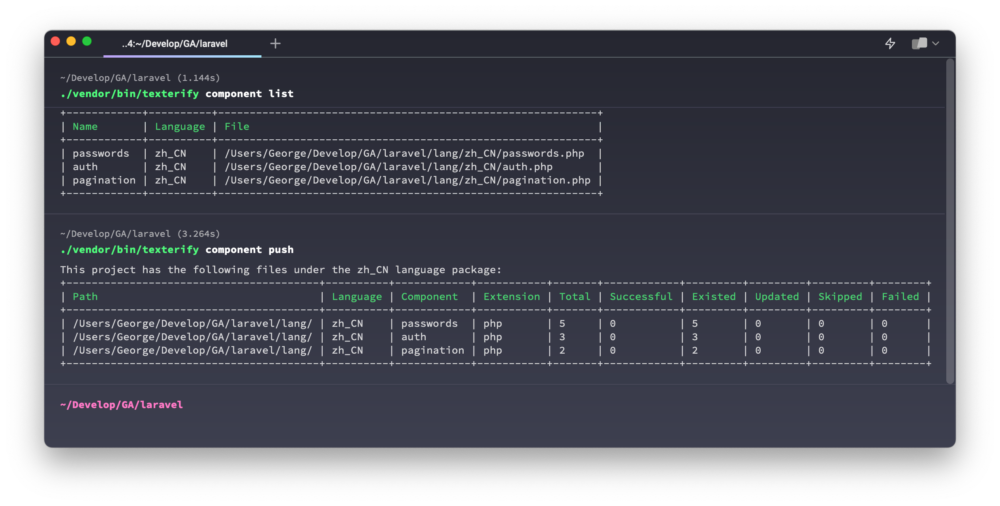

# Texterify CLI

A command-line tool for batch synchronization of language packs between local and texterify TMS.



# Features

* [X] Push project language packages to the Texterify service
* [X] Pull Texterify translated language packs to your local project
* [X] Support for beautifying PHP array code using short array format (using laravel/pint package)

# Installation

```shell
composer global require betterde/texterify
```
or
```shell
composer require betterde/texterify --dev
```

# Config

The texterify utility can be configured by placing a `.texterify.json` in your project folder. 

You can use `texterify auth <endpoint> <project> <email> <token>` command to generate the `.texterify.json` config file.

The authentication against the Texterify server is configured in the project `.texterify.json` configuration file. Make sure to always keep the config file private.

Example:

```json
{
    "endpoint": "https:\/\/your.domain.com\/api\/v1",
    "project": "XXXXXXXX-XXXX-XXXX-XXXX-XXXXXXXXXXXX",
    "email": "developer@example.com",
    "token": "XXXXXXXXXXXXXXXXXXXXX"
}
```
* endpoint: The API service endpoint of Texterify.
* email: The email you use to log in on Texterify.
* project: The project you want to manage. The project ID can be found on the project overview site or in the URL of the project sites.
* token: An access token you can generate at https://{your.domain.com}/dashboard/settings/access-tokens.

# Usage

If you have successfully configured your project you can try to do `texterify <command>` in the directory where you placed your project config. To get a list of all commands your current version supports try `texterify -h`.

```shell
Texterify CLI v1.0.1

Usage:
  command [options] [arguments]

Options:
  -h, --help            Display help for the given command. When no command is given display help for the list command
  -q, --quiet           Do not output any message
  -V, --version         Display this application version
      --ansi|--no-ansi  Force (or disable --no-ansi) ANSI output
  -n, --no-interaction  Do not ask any interactive question
  -v|vv|vvv, --verbose  Increase the verbosity of messages: 1 for normal output, 2 for more verbose output and 3 for debug

Available commands:
  auth        Generate authentication information
  completion  Dump the shell completion script
  component   The operations of components
  help        Display help for a command
  language    Display the languages supported by the project
  list        List commands
  project     The operations of project
```

# License

This project is licensed under the MIT License. See the LICENSE file for details.